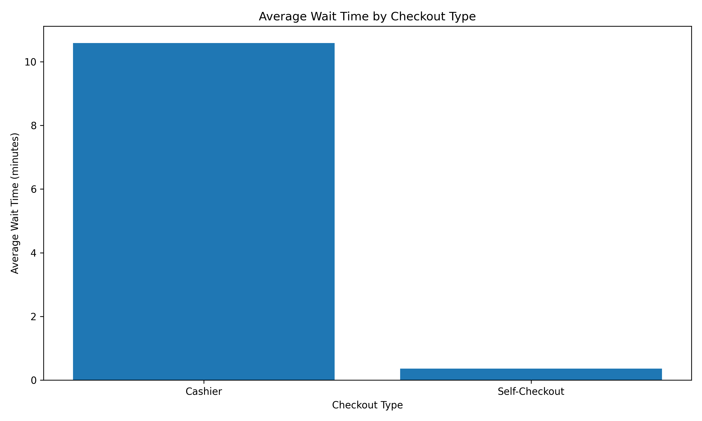
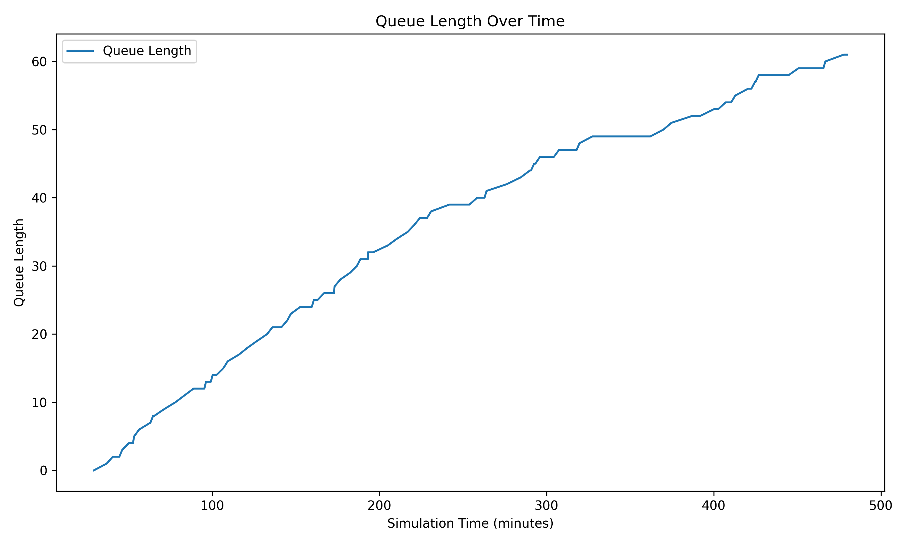

# Grocery Store Simulation
**By:**
- Peyton Slater
- Meme Chhay
- Garrett Iverson

**Simulation 001**

**Instructor:** Dr. Doug Williams

**Date:** April 11, 2024

## Description
This simulation models the behavior of a grocery store with both cashier and self-checkout options. The purpose is to analyze customer flow, checkout queue lengths, and wait times under various store configurations and customer behaviors.

## Variables
- `simulation_time`: Duration of the simulation (in minutes)
- `num_cashiers`: Number of cashier checkouts available
- `num_self_checkouts`: Number of self-checkout stations available
- `arrival_rate`: Average number of customers arriving per hour
- `shopping_time_mean`: Mean shopping time for customers (in minutes)
- `shopping_time_std`: Standard deviation of shopping time (in minutes)
- `cashier_service_time_mean`: Mean service time at cashier checkouts (in minutes)
- `cashier_service_time_std`: Standard deviation of service time at cashier checkouts (in minutes)
- `self_checkout_service_time_mean`: Mean service time at self-checkout stations (in minutes)
- `self_checkout_service_time_std`: Standard deviation of service time at self-checkout stations (in minutes)
- `seed`: Random seed for reproducibility

## Distributions
- Customer arrivals follow a Poisson distribution with an average arrival rate of `arrival_rate` customers per hour.
- Shopping times are normally distributed with a mean of `shopping_time_mean` and a standard deviation of `shopping_time_std`.
- Service times at cashier checkouts are normally distributed with a mean of `cashier_service_time_mean` and a standard deviation of `cashier_service_time_std`.
- Service times at self-checkout stations are normally distributed with a mean of `self_checkout_service_time_mean` and a standard deviation of `self_checkout_service_time_std`.

## Simulation Results

*Figure 1: Simulation Results Table*

This table displays the raw data from the simulation, including timestamps, checkout types, service times, and queue times.

*Figure 2: Average Wait Time Comparison*

This graph compares the average wait time for customers using cashier checkout versus self-checkout. It helps identify which checkout type results in longer wait times.

*Figure 3: Queue Length Over Time*

This graph shows the length of the queue over time, providing insights into how the queue length changes throughout the simulation.

*Figure 4: Checkout Efficiency*

The graph above compares the efficiency of cashier checkout versus self-checkout, measured as customers processed per hour.

*Figure 5: Customer Checkout Preference*

This pie chart shows the percentage of customers who prefer cashier checkout versus self-checkout, providing insights into customer preferences.

*Figure 6: Resource Utilization*

This graph compares the utilization of cashier checkout versus self-checkout, providing insights into which resources are being used more efficiently.

*Figure 7: Sensitivity Analysis*

The graph above shows the average wait time as a function of customer arrival rate, providing insights into how changes in arrival rate affect wait times.
## Analysis
Based on the simulation results, we can observe the following:
- The average shopping time remains relatively stable throughout the simulation, while the average service time shows some variability.
- In this particular simulation run, the cashier queue has a longer queue length compared to the self-checkout queue.
- The average wait time is higher for the cashier queue compared to the self-checkout queue.

These insights can help store managers make informed decisions about resource allocation, staffing, and checkout configurations to optimize customer experience and reduce wait times.

## Conclusion
The grocery store simulation provides a valuable tool for understanding customer behavior, queue dynamics, and service performance in a retail setting. By adjusting the simulation parameters, such as the number of cashiers and self-checkout stations, arrival rate, and service time distributions, various scenarios can be explored to identify optimal store configurations and improve overall efficiency.